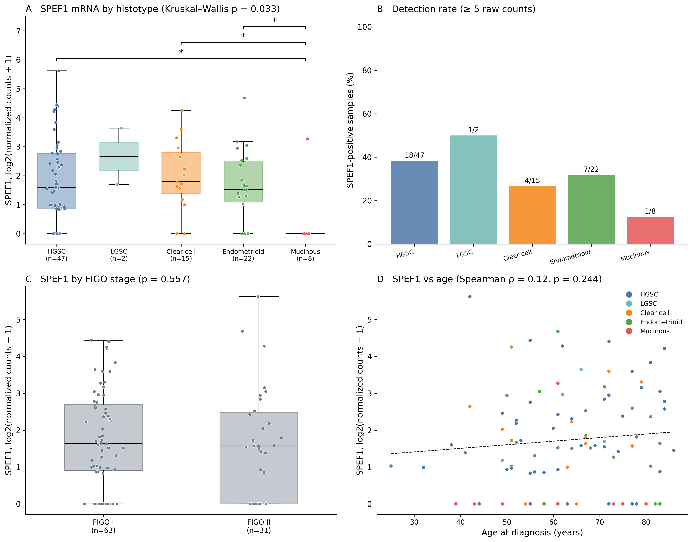
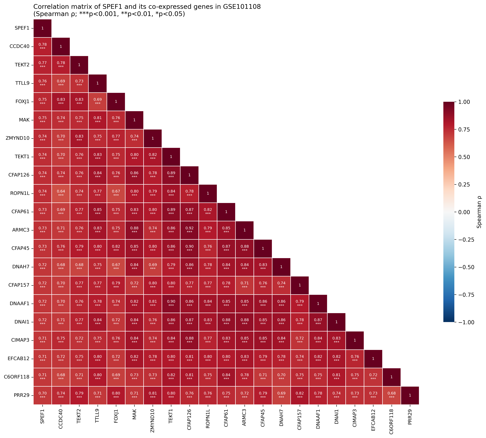
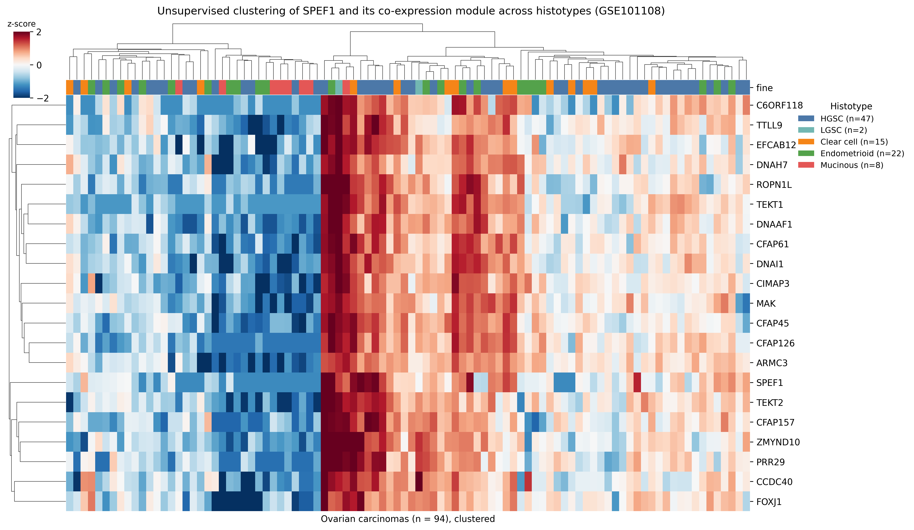

# SPEF1 in ovarian cancer — GSE101108 analysis pipeline

Code for the transcriptomic (dataset) results of the study
**"Expression of SPEF1 in Primary Ovarian Cancer"**.

## About the study

SPEF1 (sperm flagellar 1) is an axonemal, calponin-homology actin-bundling protein
of motile cilia, and a member of the cancer–testis-like group of antigens whose
expression is normally restricted to the testis but re-emerges in tumours. The
paper characterizes SPEF1 in primary ovarian carcinoma by combining three
complementary lines of evidence:

- **Immunohistochemistry** on a tissue microarray of ovarian carcinomas, lymph-node
  metastases and normal ovary, scored semi-quantitatively.
- **Bioinformatic analysis** of the SPEF1 protein–protein interaction network and
  its functional (Gene Ontology) enrichment (STRING), and of prognostic value
  (KM-plotter).
- **Independent validation** in a histotype-annotated RNA-sequencing cohort,
  **GSE101108** (94 early-stage primary invasive ovarian carcinomas spanning all
  major histotypes), which is what this repository processes.

This repository contains **source code only**. No patient or dataset files are
distributed: GSE101108 is downloaded from GEO at run time and the reference data
are recreated locally.

## Highlights

- SPEF1 protein is **absent from normal ovary** but expressed across ovarian
  carcinoma histotypes on the tissue microarray (low-grade serous 87.5%, mucinous
  70%, clear cell 66.7%, high-grade serous 51.9%, endometrioid 33.3%); every
  carcinoma histotype except endometrioid is significantly positive relative to
  normal ovary (Fisher exact, BH-corrected).
- Its interaction network and co-expression module converge on **motile-cilium /
  axoneme** biology — SPEF1 marks a ciliary transcriptional programme.
- In the independent GSE101108 cohort, SPEF1 mRNA is detected in **33% of
  carcinomas** and is **virtually absent in the mucinous histotype** (Kruskal–Wallis
  p = 0.033), independent of FIGO stage and age.
- SPEF1 expression is **inversely related to immune infiltration** (lower immune-cell
  marker scores and lower CD274, PDCD1LG2 and HAVCR2), i.e. ciliated, well-
  differentiated tumour areas are comparatively immune-poor.
- In public survival data, **high SPEF1** associates with **better overall,
  progression-free and post-progression survival**.

## Selected results

<table>
<tr>
<td align="center" width="33%"></td>
<td align="center" width="33%"></td>
<td align="center" width="33%"></td>
</tr>
<tr>
<td align="center"><em>SPEF1 mRNA by histotype and clinical associations (HGSC/LGSC split)</em></td>
<td align="center"><em>Correlation matrix of the SPEF1 co-expression module</em></td>
<td align="center"><em>Unsupervised clustering of SPEF1 and its co-expressed genes</em></td>
</tr>
</table>

*Figures generated by the scripts in this repository from GSE101108.*

## What it reproduces

| Manuscript item | Script |
|---|---|
| Fig. 3 — SPEF1 mRNA by histotype and clinical associations (HGSC/LGSC split), Table 2 (cohort characteristics), Table 6 (TMA, semi-quantitative) | `SPEF1_analysis/regen_histotype_tables.py` |
| Fig. 4 — SPEF1 co-expression correlation matrix (significance stars) | `SPEF1_analysis/regen_coexpression_figures.py` |
| Fig. 5 — unsupervised clustering heatmap (SPEF1 + 20 co-expressed genes) | `SPEF1_analysis/regen_coexpression_figures.py` |
| Fig. 6 — differential expression (volcano) | `SPEF1_analysis/main.py` |
| Fig. 7 — GO enrichment of the co-expression module (STRING style) | `SPEF1_analysis/regen_dataset_go.py` |
| Fig. 8 — association with the immune microenvironment | `SPEF1_analysis/main.py` |
| Table 3 — SPEF1 detection by histotype, Table 4 — top GO terms, results workbook | `SPEF1_analysis/main.py` |

Not generated by this code:

- **Figs 1–2 and Table 1 (STRING)** — the SPEF1 protein–protein interaction network
  and its GO enrichment were exported directly from the string-db.org web interface
  (SPEF1-centered query, *Homo sapiens*), and Table 1 lists the node degrees of that
  network.
- **Figs 9–10** are representative immunohistochemistry images, and **Table 5** comes
  from the external KM-plotter web tool.

## Repository layout — two stages

```
GSE101108_pipeline/   Stage 1 — download, metadata normalization, histotype
                      classification, expression-matrix assembly
SPEF1_analysis/       Stage 2 — SPEF1 co-expression, differential expression,
                      GO over-representation, immune signatures, figures/tables
run_all.py            End-to-end driver (stage 1 -> stage 2 -> figure scripts)
```

The work is split into two packages on purpose:

- **`GSE101108_pipeline/` — data engineering (gene-agnostic).** It turns the public
  GEO series into a clean, analysis-ready dataset: it downloads GSE101108, normalizes
  the sample metadata, classifies the histotypes with explicit, auditable rules, maps
  gene identifiers to symbols, and assembles the expression matrices. This step is
  slow (network, one-off) and independent of SPEF1 — the same prepared cohort could
  drive any downstream analysis.
- **`SPEF1_analysis/` — the science (SPEF1-specific).** It consumes Stage 1's
  expression matrices and produces the actual results of the paper: SPEF1 co-expression,
  differential expression, GO over-representation, immune-signature association, and the
  manuscript figures and tables. This step is fast and re-run many times.

Keeping them apart means each has its own `config.py`, `main.py`, `src/` modules and
`tests/`, the heavy download is decoupled from the analysis you iterate on, and the
data-preparation stage stays reusable.

## Requirements

Python 3.10+ and the packages in `requirements.txt`:

```bash
pip install -r requirements.txt
```

## Running

From the repository root:

```bash
python run_all.py                 # full reproduction
python run_all.py --skip-download # reuse a previous GEO download
python run_all.py --skip-tma      # skip the tissue-microarray table (Table 6)
```

Or one stage at a time:

```bash
python GSE101108_pipeline/main.py                  # download + prepare the cohort
python SPEF1_analysis/main.py                      # core analysis + volcano/immune + workbook
python SPEF1_analysis/regen_histotype_tables.py    # Fig 3 + Table 2 (+ Table 6 if TMA present)
python SPEF1_analysis/regen_coexpression_figures.py  # Fig 4 correlation matrix + Fig 5 heatmap
python SPEF1_analysis/regen_dataset_go.py          # Fig 7 dataset GO (STRING style)
```

Outputs are written under `SPEF1_analysis/results/` (figures as 300-dpi PNG and
LZW-compressed TIFF; tables as CSV and multi-sheet Excel).

## Data notes

- **GSE101108** is fetched from NCBI GEO on the first run and cached under
  `GSE101108_pipeline/data/` (git-ignored). Raw counts are annotated on hg19.
- **GO annotations** come from NCBI `gene2go`, filtered to human in streaming mode,
  so no external enrichment server is required.
- **Tissue-microarray scores** (Table 6) are the paper's immunohistochemistry raw
  data and are *not* included. To regenerate Table 6, place the Excel file at
  `data/TMA_SPEF1_expression.xlsx`; without it, `regen_histotype_tables.py` still
  writes Fig 3 and Table 2 and simply skips Table 6.

## Reproducibility

- Counts are normalized with the median-of-ratios method (DESeq2-style).
- All hypothesis tests are non-parametric (Mann–Whitney, Kruskal–Wallis, Fisher
  exact, Spearman), with Benjamini–Hochberg FDR control; effect sizes are Cliff's
  delta. The values quoted in the manuscript are written to
  `SPEF1_analysis/results/tables/manuscript_numbers.json` — none are typed by hand.
- Unit tests:

```bash
python -m pytest GSE101108_pipeline/tests -v
python -m pytest SPEF1_analysis/tests -v
```

## License

MIT — see [LICENSE](LICENSE).
